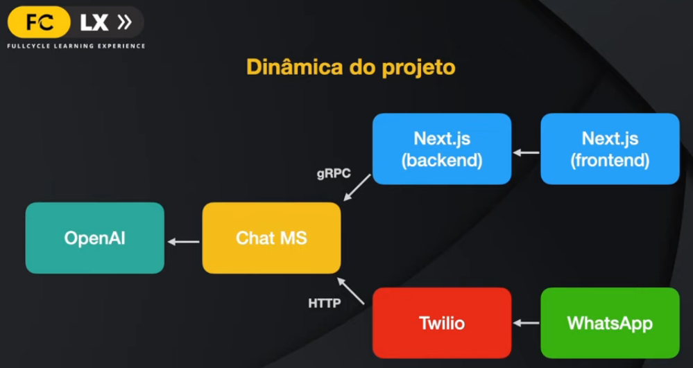

# Fyll Cycle Learning Experience

17 de Abril de 2023

------
### Chat web: 

------
### Setup:

  - execute `make up`

  - setup web:
    - Acesse o Keycloak em [http://localhost:9000](http://localhost:9000) com o usuário `admin`, e crie um novo `Client` informando o `Client ID`.
    - Com o Client ID e o Client Secret em mãos, adicione os mesmos no [web/.env](./web/.env)
    - Informe também um `NEXTAUTH_SECRET` que pode ser qualquer coisa, é usado como chave para gerar o token `jwt`
    - Crie também um novo usuário para acessar o chat

  - setup chatservice:
    - Para que a comunicação com o Chat GPT funcione, gere uma chave de api em [platform.openai.com](https://platform.openai.com) e cole o mesmo em `OPENAI_API_KEY` no seu [chatservice/.env](./chatservice/.env)

------

- Migrations:
  - lib utilizada: [golang-migrate](https://github.com/golang-migrate/migrate)
  - Comando utilizado para inicializar as migrations:
  `make new-migration`
  - no arquivo [query.sql](chatservice/sql/queries/query.sql) são descritos as queries necessárias, com a anotação do método correspondende que vai ser gerado, após preenchido é só executar o comando `cli/sqlc-generate` para gerar o código Go que corresponderá ao "repositório" com os métodos descritos na query.

-----
